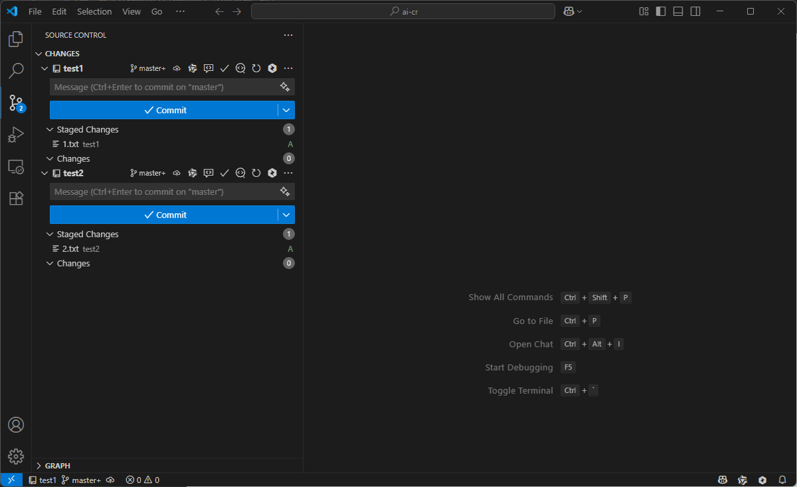

# ETRX AI Code Review

一个VS Code插件，为Git提交提供AI驱动的代码审查功能。

## 功能特性

- 🎯 **一键代码审查**: 在Git提交消息框处添加"Code Review"按钮
- 🤖 **多AI模型支持**: 支持Ollama本地模型和OpenRouter云端模型
- 📝 **可配置提示词**: 支持自定义代码审查提示词模板
- 📊 **详细报告**: 生成Markdown格式的审查报告
- ⚡ **实时反馈**: 直接在VS Code中查看审查结果



## 配置

### 基本配置

打开VS Code设置，搜索 `ETRX AI Code Review`：

- **Model Provider**: 选择AI模型提供商（ollama/openrouter）
- **Output Path**: 审查结果保存路径（默认为 `./.ai-codereview`，文件命名规则为 `ai-codereview-YYMMDD-hhmm.md`）

### Ollama配置

如果使用Ollama本地模型：

- **Ollama URL**: 本地Ollama服务地址（默认 `http://localhost:11434`）
- **Ollama Model**: 使用的模型名称（默认 `qwen3:8b`）

### OpenRouter配置

如果使用OpenRouter云端模型：

- **OpenRouter API Key**: 你的OpenRouter API密钥
- **OpenRouter Model**: 使用的模型名称（默认 `moonshotai/kimi-k2:free`）

### 提示词模板配置

在设置中配置 `Prompt Templates`，支持以下变量：
- `{diff}`: 将被替换为实际的代码变更内容

示例模板：

```json
{
  "default": "请对以下代码变更进行详细的代码审查，关注代码质量、安全性、性能、最佳实践等方面。\n\n代码变更：\n{diff}",
  "security": "请重点关注以下代码变更中的安全风险，包括但不限于SQL注入、XSS、权限控制、敏感信息泄露等安全问题。\n\n代码变更：\n{diff}",
  "performance": "请分析以下代码变更的性能影响，包括时间复杂度、空间复杂度、算法效率、资源使用等方面。\n\n代码变更：\n{diff}"
}
```

## 使用方法

1. **准备代码变更**: 确保你的更改已经添加到暂存区（`git add`）
2. **启动代码审查**: 
   - 在源代码管理视图中点击"Code Review"按钮
   - 或使用命令面板运行 `ETRX AI: Code Review`
3. **选择模板**: 选择适合的审查模板（如果配置了多个）
4. **查看结果**: 审查完成后，结果将自动在编辑器中打开

## 示例输出

审查结果将保存为Markdown文件，文件命名规则为 `ai-codereview-YYMMDD-hhmm.md`，保存在 `.ai-codereview` 目录中。文件内容包含：

- 审查时间戳
- 变更文件列表
- AI生成的详细审查意见
- 具体的改进建议

## 故障排除

### 常见问题

1. **"No staged changes found"**
   - 确保使用 `git add` 将更改添加到暂存区

2. **Ollama连接失败**
   - 检查Ollama服务是否运行： `ollama serve`
   - 验证模型是否已安装： `ollama pull qwen3:8b`

3. **OpenRouter API错误**
   - 检查API密钥是否正确
   - 确认账户余额充足

4. **Git命令失败**
   - 确保项目目录是Git仓库
   - 检查Git是否已安装并配置

## 开发

有关开发指南，请参阅 [docs/DEVELOPMENT.md](docs/DEVELOPMENT.md)。

## 许可证

MIT License